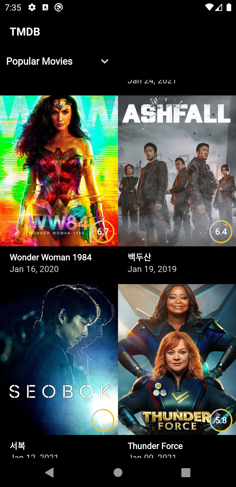
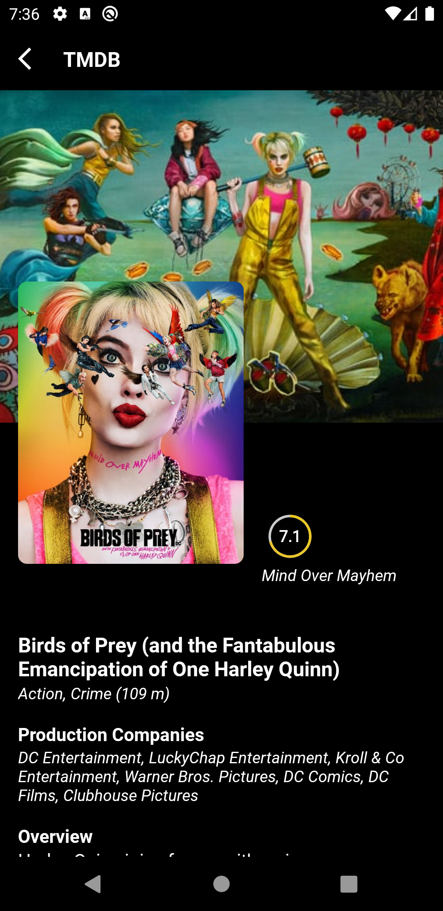
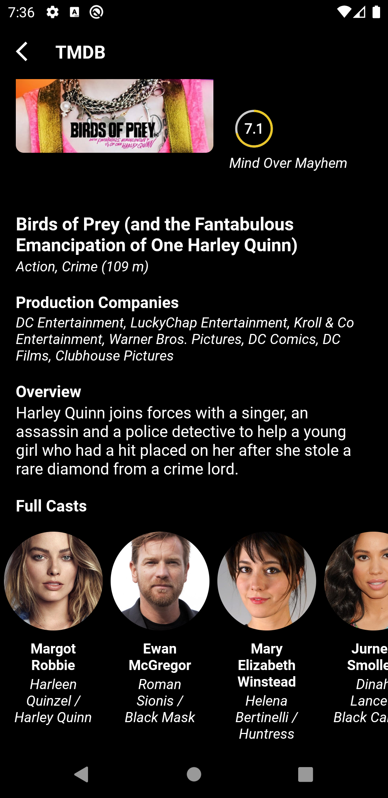

# TheMovie

TheMoive is a small demo application based on modern Android application tech-stacks and MVVM architecture. This project is for focusing especially on the new library Hilt of implementing dependency injection. Also fetching data from the network and integrating persisted data in the database via repository pattern.

## Screenshopts

## Architecture

* [MVVM Architecture](https://www.googleadservices.com/pagead/aclk?sa=L&ai=DChcSEwjK3u72jYPxAhVVh0sFHXXjDYUYABAAGgJzZg&ohost=www.google.com&cid=CAESQOD2XFcmPuIcTP24qAGRLr8lgw8-kVpWnbHw3glvNILr8B9UyDMpPQB-5vYiruWMF09MN4gx1oRC40CNYeifO4E&sig=AOD64_1HcbJ9FuCgqd4WZrhRJItLyvCd9w&q&adurl&ved=2ahUKEwjj-uX2jYPxAhWyzjgGHag1BUEQ0Qx6BAgCEAE) (View - Databinding - ViewModel - Model)
* Repository pattern

## Tech stack & Open-source libraries

* [Kotlin](https://developer.android.com/kotlin?gclid=Cj0KCQjw5PGFBhC2ARIsAIFIMNcxqbwHscrWV99P1uNM2TlC4ePTeJrBhZ-0Od2pUZOKox6CyWmO85QaAhYOEALw_wcB&gclsrc=aw.ds) based, [Coroutines](https://developer.android.com/kotlin/coroutines?gclid=Cj0KCQjw5PGFBhC2ARIsAIFIMNcDLo3-0f-EqAFXKbqDjkAJS8VCf-6BVP9xABZlVN1Vgj3eVW15SL8aAkogEALw_wcB&gclsrc=aw.ds) for asynchronous.
* [Hilt](https://developer.android.com/training/dependency-injection/hilt-android)
* [Android JetPack](https://developer.android.com/jetpack?gclid=Cj0KCQjw5PGFBhC2ARIsAIFIMNeNBS7HMrBCiuGX20lMHkq62UckuQ9wgOhTvFN8-vpRU9ChODgjlz4aAl5SEALw_wcB&gclsrc=aw.ds)
* [Lifecycle](https://developer.android.com/topic/libraries/architecture/lifecycle) - dispose of observing data when lifecycle state changes.
* [ViewModel](https://developer.android.com/reference/android/arch/lifecycle/ViewModel) - UI related data state holder and life cycle aware.
* [Room Persistence](https://developer.android.com/training/data-storage/room) - construct a database using the abstract data layer.
* [Retrofit & OKHttp3 ](https://www.google.com/url?sa=t&rct=j&q=&esrc=s&source=web&cd=&ved=2ahUKEwiFrciMjYPxAhXTzzgGHQJpBV0QFjAKegQIBxAD&url=https%3A%2F%2Fsquare.github.io%2Fretrofit%2F&usg=AOvVaw2yIseA3bhrHlJGtWcQtp3G)- construct the REST API response and handling the error responses.
* [Moshi](https://github.com/square/moshi) - Modern JSON librery for Kotlin and Java.
* [Glide](https://github.com/bumptech/glide) - Use for loading network and local image.
* [Timber](https://github.com/JakeWharton/timber) - For logging.
* [Material Components ](https://material.io/develop/android/docs/getting-started)- Material design component UI related.

##  Opensource API

The Movie app is using the the [TMDB](https://www.themoviedb.org/documentation/api) for construction RESTful API.
The Movie Database (TMDb) is a community built movie and TV database. Every piece of data has been added by our amazing community dating back to 2008. TMDb's strong international focus and breadth of data is largely unmatched and something we're incredibly proud of. Put simply, we live and breathe community and that's precisely what makes us different.

## License

Designed and developed by 2021 Hein Htet

Licensed under the Apache License, Version 2.0 (the "License");
you may not use this file except in compliance with the License.
You may obtain a copy of the License at

   http://www.apache.org/licenses/LICENSE-2.0

Unless required by applicable law or agreed to in writing, software
distributed under the License is distributed on an "AS IS" BASIS,
WITHOUT WARRANTIES OR CONDITIONS OF ANY KIND, either express or implied.
See the License for the specific language governing permissions and
limitations under the License.

